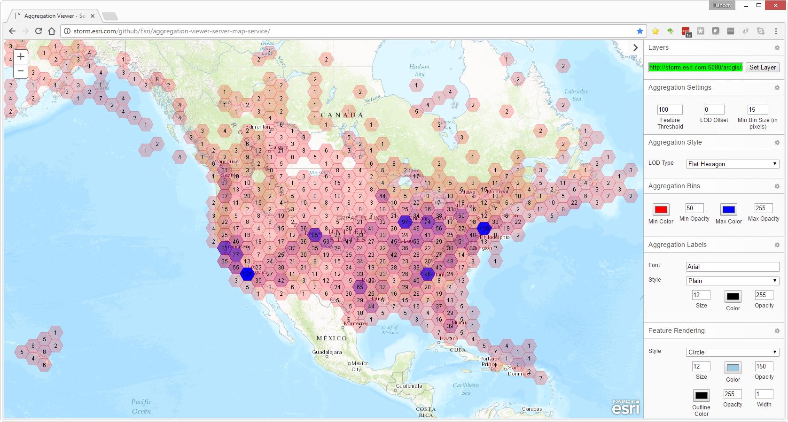
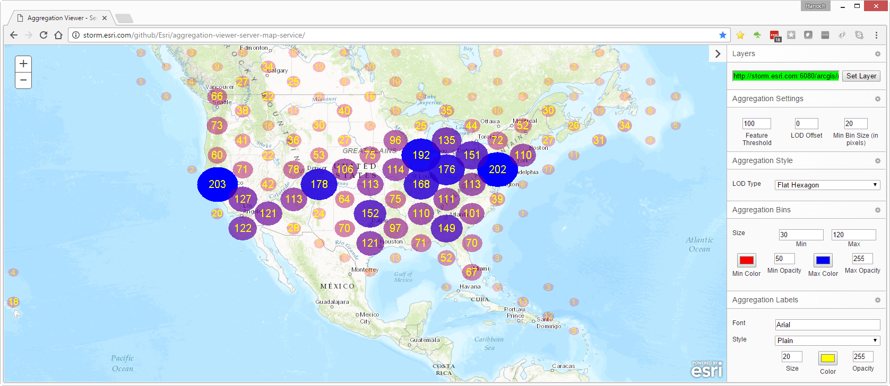
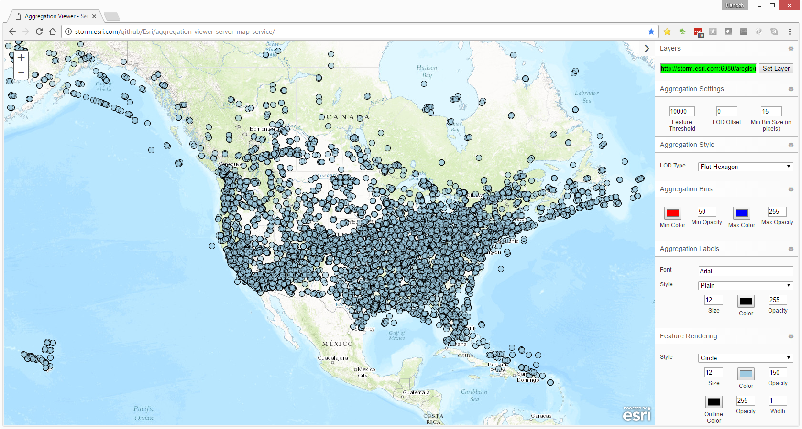

# Aggregation Viewer Server Map Service

A JavaScript-based map visualization application that demonstrates server-side aggregation rendering using ArcGIS Dynamic Map Service Layer. This sample showcases how to render large datasets efficiently by aggregating features server-side and displaying them with various visualization styles.

## Features

- **Server-side Aggregation**: Renders map images server-side using aggregation renderers
- **Multiple Aggregation Styles**: Support for Geohash, Square, Flat Hexagon, Pointy Hexagon, and Triangle styles
- **Dynamic Rendering**: Automatically switches between aggregated and raw feature rendering based on feature count thresholds
- **Real-time Updates**: Live data refresh capabilities with configurable refresh rates
- **Time-based Visualization**: Replay mode with time slider for temporal data analysis
- **Interactive Controls**: Comprehensive UI for customizing aggregation parameters

## Quick Start

1. Open `index.html` in a web browser
2. Enter a valid ArcGIS map service URL that supports aggregation rendering
3. Configure aggregation settings using the control panel
4. Explore different visualization styles and parameters

For detailed installation instructions, see [INSTALL.md](INSTALL.md).

## Architecture

- **Frontend**: HTML5, CSS3, JavaScript with Dojo Toolkit and ArcGIS API for JavaScript 3.44
- **Rendering**: Server-side aggregation using ArcGIS Dynamic Map Service Layer
- **Styling**: Custom flat UI theme with responsive design

## Configuration Options

### Aggregation Settings
- **Feature Threshold**: Controls when to switch between aggregated and raw feature rendering
- **Aggregation Style**: Choose from multiple geometric aggregation patterns
- **Bin Rendering**: Grid or Oval rendering styles with customizable sizing
- **Statistics**: Count-based or field-based statistical aggregation

### Visualization Controls
- **Labels**: Configurable bin labels with custom formatting
- **Colors**: Customizable fill and outline colors with value-based interpolation
- **Spatial Reference**: Support for different coordinate systems

## Screenshots

Server-side rendering with Flat Hexagon Grid style:

Server-side rendering with Flat Hexagon Oval style:

Automatic switch to raw features when below threshold:

## Browser Support

- Modern browsers supporting ES5+ and HTML5
- Tested with Chrome, Firefox, Safari, and Edge

## Dependencies

- ArcGIS API for JavaScript 3.44
- Dojo Toolkit (included with ArcGIS API)
- Font Awesome 4.x for icons

## Documentation

- **[Installation Guide](INSTALL.md)** - Complete installation and setup instructions
- **[Development Guide](doc/DEVELOPMENT.md)** - Development setup, code organization, and contribution guidelines
- **[Aggregation Renderer Specification](doc/aggregation-renderer-spec/README.md)** - Detailed technical specification for aggregation rendering
- **[API Documentation](doc/api/README.md)** - JavaScript API reference and usage examples

## Development

The application uses a modular structure:
- `index.html` - Main application entry point
- `mapServiceViewerStyles.css` - Application styling
- `js/` - JavaScript modules (if present)
- `flat/` - UI theme components

For detailed development information, see [doc/DEVELOPMENT.md](doc/DEVELOPMENT.md).

## Issues

Found a bug or want to request a new feature? Please let us know by submitting an issue.

## Contributing

Esri welcomes contributions from anyone and everyone. Please see our [guidelines for contributing](https://github.com/esri/contributing) and the [Development Guide](doc/DEVELOPMENT.md) for technical details.

## License

Copyright 2017 Esri

Licensed under the Apache License, Version 2.0 (the "License");
you may not use this file except in compliance with the License.
You may obtain a copy of the License at

   http://www.apache.org/licenses/LICENSE-2.0

Unless required by applicable law or agreed to in writing, software
distributed under the License is distributed on an "AS IS" BASIS,
WITHOUT WARRANTIES OR CONDITIONS OF ANY KIND, either express or implied.
See the License for the specific language governing permissions and
limitations under the License.

A copy of the license is available in the repository's [license.txt](license.txt) file.
