|   |
|---|

 Overview
============

This document outlines the specification for the spatiotemporal big data store
map service. You can access map service specification by following two methods
from ArcGIS GeoEvent Manager (e.g. ):

1.  When you create a new data source in GeoEvent Manager:

    1.  Navigate to **Services Outputs**

    2.  Click **Add Output**

    3.  Select the **Add a Feature to a Spatiotemporal Big Data Store** output

    4.  Click **Create Data Source**

    5.  Access map service properties under *Aggregation Rendering* and *Feature
        Rendering*

2.  When you edit an existing spatiotemporal big data store map service in
    GeoEvent Manager:

    1.  Navigate to **Site Spatiotemporal Big Data Stores**

    2.  Locate the existing spatiotemporal big data store map service and click

        

        to edit the map service

    3.  Access map service properties under *Aggregation Rendering* and *Feature
        Rendering*

Map Service Specification
=========================

Hosted spatiotemporal big data store map services can be rendered aggregated
using a chosen aggregation style or by rendering the discrete features. This
document will cover both the options available for aggregation rendering as well
as those for discrete (aka “raw”) feature rendering.

Aggregation Rendering
---------------------

Hosted spatiotemporal big data store map services can be rendered using
different aggregation styles. The aggregation styles and associated properties
for the supporting map services are highlighted below.

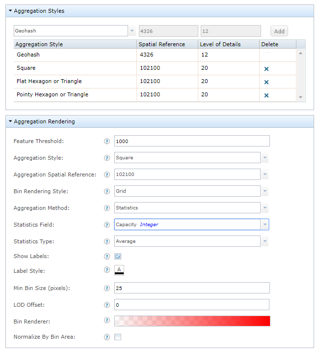

### Feature Threshold

The feature threshold is used to determine when to switch the rendering style of
the map service between an aggregation style and discrete features. When the
number of features to be rendered in the current map extent is more than the
feature threshold specified, the features will be rendered using an aggregation
style; if equal or less, the features will be rendered using raw discrete
features. With the feature threshold set to the default value of 0, the features
will render aggregated using the chosen aggregation style at all scales.

>   **EXAMPLE:** With a feature threshold value set to 20, when the map is
>   zoomed out and more than 20 features in the current map extent need to be
>   rendered, the features will be aggregated into bins and will be rendered
>   using the defined aggregation style as illustrated below.

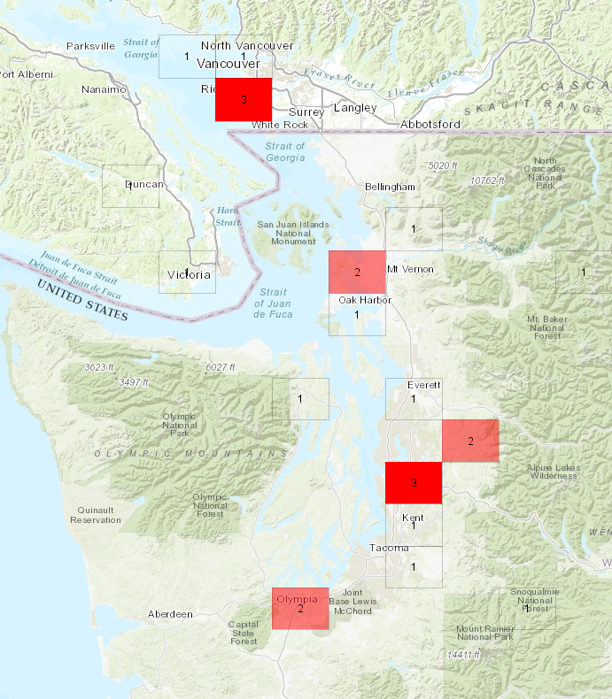

>   When you zoom in on the map to display equal or less than 20 features in
>   current map extent, the features will be rendered using the defined raw
>   discrete feature rendering style as illustrated below.

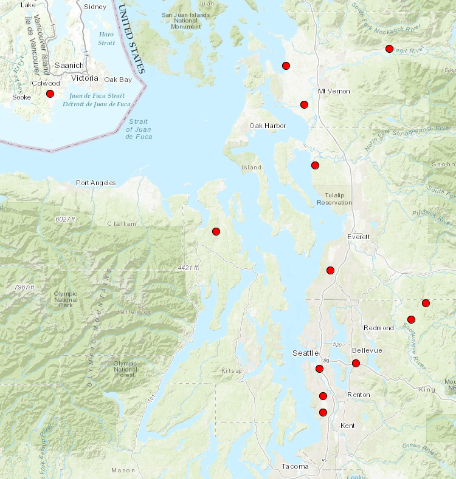

### Aggregation Style

The aggregation style the aggregation renderer will use to display the
aggregated features.

| **Geohash**                              | **Square**                                 |
|------------------------------------------|--------------------------------------------|
| [./media/image5.png](./media/image5.png) | [./media/image6.png](./media/image6.png)   |
| **Flat Hexagon**                         | **Pointy Hexagon**                         |
| [./media/image7.png](./media/image7.png) | [./media/image8.png](./media/image8.png)   |
| **Flat Triangle**                        | **Pointy Triangle**                        |
| [./media/image9.png](./media/image9.png) | [./media/image10.png](./media/image10.png) |

### Aggregation Spatial Reference

The spatial reference well-known ID (WKID) or well-known text (WKT) to use for
aggregation rendering. This property is relevant and enabled only when the
Geohash aggregation style is NOT selected. The Geohash aggregation style is
defined to only use WKID=4326 (using predefined 12 level of details), as defined
by the Geohash specification.

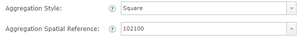

### Bin Rendering Style

The aggregation bin-rendering-style is used to determine how the aggregated bins
are rendered.

Using the *Grid* bin-rendering-style, the bins will be rendered as polygon
outlines with a fill to form a ‘grid’ along the aggregation style axes.

Using the *Oval* bin-rendering-style, the bins will be rendered as ellipses with
diameters that will encapsulate an oval inside the bin’s shape, centered around
the bin’s center point, following the aggregation style axes.

| **Geohash** |      |
|-------------|------|
| Grid        | Oval |

| **Square**          |      |
|---------------------|------|
| Grid                | Oval |
| **Flat Hexagon**    |      |
| Grid                | Oval |
| **Pointy Hexagon**  |      |
| Grid                | Oval |
| **Flat Triangle**   |      |
| Grid                | Oval |
| **Pointy Triangle** |      |
| Grid                | Oval |

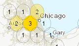

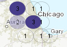

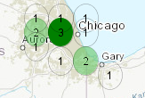

When the *Oval* bin rendering style is selected, the *Size (in percentage)*
parameter is enabled in the *Bin Renderer* property for calculating each oval
bin size based on its bin value. The oval bin size for each bin is determined by
using its bin value as a weight to interpolate from the min to the max size
values.

>   **EXAMPLE:** As illustrated below, the oval bin sizes are interpolated from
>   30% for the min value to 100% for the max value. Bins with the min bin value
>   use 30% of the oval size, bins with the max bin value use 100% of the oval
>   size, and the other bins use its bin values as a weight to interpolate from
>   the min to the max values. As a result, bins with values of 1, 2, 3 are
>   rendered with increasing sizes. When the min and the max size values are set
>   to the same value, oval bin sizes are not differentiated by bin values and
>   result in the same oval bin size for all bins. Also see the *Range* setting
>   in the *Bin Renderer* property.

| **Oval – 30%/100%**                        |                                            |
|--------------------------------------------|--------------------------------------------|
| [./media/image24.png](./media/image24.png) | [./media/image25.png](./media/image25.png) |
| **Oval – Size 100%/100%**                  |                                            |
| [./media/image26.png](./media/image26.png) | [./media/image27.png](./media/image27.png) |

### Aggregation Method

The method for calculating the aggregated bin values that appear in each bin.
Choose *Count* to display feature counts in each bin. Choose *Statistics* to
calculate statistics of all features in each bin based on the *Statistics Field*
and the *Statistics Type* parameters below.

Values: Count \| Statistics

>   **EXAMPLE**: The aggregation bin value could be the number of sensors in a
>   bin or the average temperature reported from all sensors in a bin.

### Statistics Field

The statistics field to use for calculating the aggregated statistics value.

### Statistics Type

The statistics type to use for calculating the aggregated statistics value.

Values: Average \| Maximum \| Minimum \| Standard Deviation \| Sum \| Variance
\| Count Distinct \| Count

| **Counts**                                 |
|--------------------------------------------|
| [./media/image28.png](./media/image28.png) |
| **Statistics**                             |
| [./media/image30.png](./media/image30.png) |

### Show Labels

The bin labels are displayed in each bin and represent the bin value in each
bin. When *Show Labels* is checked, the count of features or the statistic value
for each bin will be rendered around the bin’s center. When unchecked, no labels
will appear inside the bins.

| **Checked**                                | **Unchecked**                              |
|--------------------------------------------|--------------------------------------------|
| [./media/image32.png](./media/image32.png) | [./media/image33.png](./media/image33.png) |

### Label Style

The style of the bin labels – PLAIN, BOLD, ITALIC, BOLD ITALIC.

### Label Format

The label’s text value format pattern based on the Java Decimal Format
specification. For more information see:

-   <https://docs.oracle.com/javase/tutorial/i18n/format/decimalFormat.html>

You can also add “KMB” or “kMG” to format big number values with “K/k” for
thousands (aka “kilo”), “M” for millions (aka “mega”), and “B/G” for billions
(aka “giga”).

**EXAMPLE:** “\#\#\#.\#\#kMG” format will render “789.12M” instead of
“789,123,456”.

For more information see:

-   <https://en.wikipedia.org/wiki/Metric_prefix>

-   <https://physics.nist.gov/cuu/Units/prefixes.html>

### Min Bin Size (pixels)

The *Min Bin Size (pixels)* and *LOD Offset* parameters work together when
aggregating features. The goal is to render the most detailed level of detail
(LOD) possible while making the bin size (width) equal to or larger than the min
bin size specified. The aggregation renderer then applies the LOD offset to
determine the final LOD to use for rendering. The default value is: 25.

>   **EXAMPLE:** With the Min Bin Size=150 pixels and LOD Offset=2, if rendering
>   using LOD=4, the number of pixels per bin is 200. If the LOD=5, the number
>   of pixels per bin is 100. In this case, to satisfy the min bin size of 150,
>   the render uses LOD of 4 instead of LOD of 5. Because the LOD offset value
>   is 2, it then applies 2 on top of LOD 4 and eventually renders using
>   LOD=4+2=6. If the LOD offset value is set to -2, it will render using
>   LOD=4-2=2.

| **Min Bin Size (pixels) with LOD offset=0** |
|---------------------------------------------|
| 25                                          |
| 10                                          |
| 50                                          |

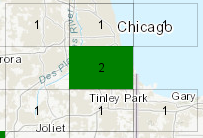

### LOD Offset

The LOD offset to apply to in addition to the LOD determined by the *Min Bin
Size* parameter above.

>   **EXAMPLE:** If based on the min bin size, the map service renders using
>   LOD=5. If the LOD Offset=3 it eventually renders using LOD=5+3=8. For the
>   same case, if LOD Offset=-3, it renders using LOD=5-3=2.

| **LOD Offset** |
|----------------|
| 0              |
| 1              |
| \-1            |

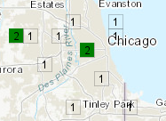

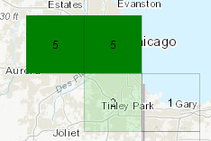

### Bin Renderer

The *Fill Color*, *Outline Color*, and *Outline Size* for each bin (as well as
the oval bin size when oval is selected for the bin rendering style), use the
bin value as a weight to interpolate from the min to the max of the *Range*
values specified. A bin with a bin value equal to the min of the range value
uses the min of the fill color, outline color, and outline size specified. In a
bin with the bin value equal to the max of the range value will use the max of
the fill color, outline color and outline size specified. If a bin value falls
between the min and the max range value, the renderer uses its bin value as a
weight to interpolate from the min to the max of range values to determine the
Fill Color, Outline Color and Outline Size for that bin. If a bin value falls
outside of the range values, the aggregation renderer will use the min value if
its bin value is smaller than the min range value and use the max value if its
bin value is greater than the max range value. If leaving min and max range
values blank, the aggregation renderer will calculate the min and max bin values
from the current map extent and use them as the min and max for the range
values.

>   **EXAMPLE:** As illustrated below, the range is set to min=100 and max=1000
>   and corresponding fill color for the min is transparent red R=255, A=0% (A
>   is the transparency) and the max is opaque red R=255 and A=100%. From the
>   final rendering, you can observe the following:

>   For bin values less than 100: the min fill color of R=255 and A=0% is used.

>   For bin values greater than 1000: the max fill color of R=255 and A=100% is
>   used.

>   For a bin value between 100 and 1000, its bin value as a weight is used to
>   interpolate from A=0% to A=100% to determine the transparency for that bin.

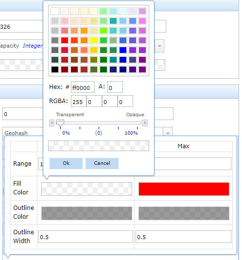

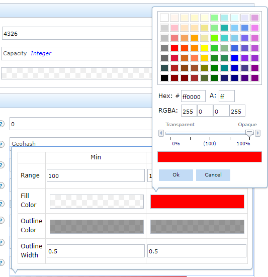

### Normalize by Bin Area

Bins that appear the same size on a map can cover a different geographically
sized area. For example, a bin at the equator covers a larger geographic area
than a bin at the north pole even if the two bins are the same size in a map. If
their bin values are the same, the bin at the equator has less density compared
with the bin at the north pole. When *Normalize by Bin Area* is checked, the
rendering is normalized. As an example, a bin at the equator will have a lighter
color, while the bin at the north pole will have a darker color, assuming the
fill color the max value uses is a darker color than the min value. When
*Normalize by Bin Area* is unchecked, the renderer treats all bins as the same
sized geographic area.

Feature Rendering
-----------------

Spatiotemporal big data store map services can render using the aggregation
style or the discrete feature style based on *Feature Threshold* parameter’s
value. Refer to the following parameters to specify how to render discrete
features.

### Feature Rendering for Points and Multipoints

**Style**

The simple marker symbol style to render discrete features.

| **Circle**                                 | **Cross**                                  |
|--------------------------------------------|--------------------------------------------|
| [./media/image45.png](./media/image45.png) | [./media/image46.png](./media/image46.png) |
| **Diamond**                                | **Square**                                 |
| [./media/image47.png](./media/image47.png) | [./media/image48.png](./media/image48.png) |
| **X**                                      | **Triangle**                               |
| [./media/image49.png](./media/image49.png) | [./media/image50.png](./media/image50.png) |
| **Pointer**                                |                                            |
| [./media/image51.png](./media/image51.png) |                                            |

*Note: If updating the feature service to render Triangle and Pointer, it still
renders using circle; if updating from map service, it renders Triangle and
Pointer for discrete features. This is a known issue.*

**Angle**

The value in degrees (0° - 360°) the simple marker symbols will be rotated for
all features. The rotation starts in the east in a counter-clockwise direction,
where east is 0°.

| **Angle examples** |     |
|--------------------|-----|
| 0°                 | 45° |

**Color**

The color of the simple marker symbol used to represent discrete features. The
default is: Red

**Size**

The size of the simple marker symbol used to represent discrete features. The
default size is: 12.

| **Size examples** |    |
|-------------------|----|
| 12                | 24 |

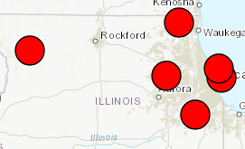

**Outline Color**

The outline color of the simple marker symbol used to represent discrete
features. The default is: Black

**Outline Size**

The outline size for the simple marker symbol used to represent discrete
features. The default is: 1

| **Outline Color/Size Examples** |        |
|---------------------------------|--------|
| Black/1                         | Pink/3 |

**X-Offset (pixels)**

The value, in pixels, to offset the discrete features on the x-axis.

**Y-Offset (pixels)**

The value, in pixels, to offset the discrete features on the y-axis.

| **Offset Examples** |                               |
|---------------------|-------------------------------|
| (0,0)               | (10,10) (move to upper right) |

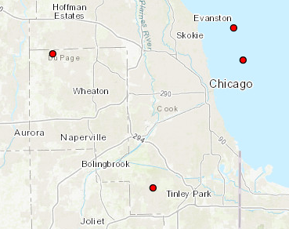

**Rotate Symbols (degrees)**

The value to rotate the simple marker symbols based on a rotation type and field
value in degrees (0°-360°).

**Rotate Type**

The rotation type used to rotate the simple marker symbols. The rotation type
chosen controls the origin and direction of rotation. If the rotation type is
defined as *arithmetic*, the symbol is rotated from east in a counter-clockwise
direction where east is the 0° axis. If the rotation type is defined as
*geographic*, the symbol is rotated from north in a clockwise direction where
north is the 0° axis.

The rotation type:

>   Arithmetic – 0° is east and advances counter-clockwise

>   Geographic – 0° is north and advances clockwise

**Rotate Field**

The field containing the value in degrees (0° - 360°) to rotate the discrete
features.

| **Arithmetic**                             |                                            |
|--------------------------------------------|--------------------------------------------|
| [./media/image62.png](./media/image62.png) |                                            |
| Not rotated                                | Rotated                                    |
| **Geographic**                             |                                            |
| [./media/image65.png](./media/image65.png) |                                            |
| Not rotated                                | Rotated                                    |
| [./media/image63.emf](./media/image63.emf) | [./media/image66.emf](./media/image66.emf) |

### Feature Rendering for Polygons

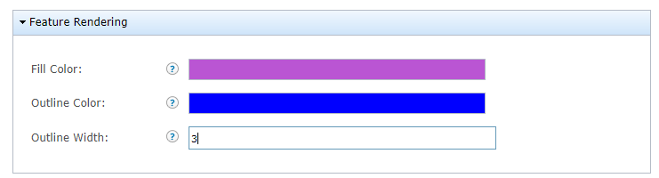

**Fill Color**

The fill color of the polygon.

**Outline Color**

The outline color of the polygon.

**Outline Size**

The size of the polygon outline.

### Feature Rendering for Polylines

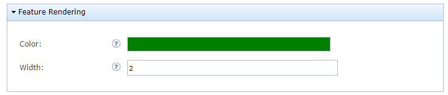

**Color**

The color of the polyline.

**Size**

The size of the polyline.

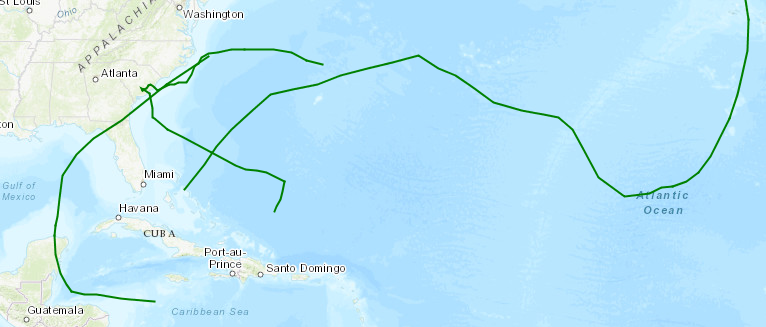
